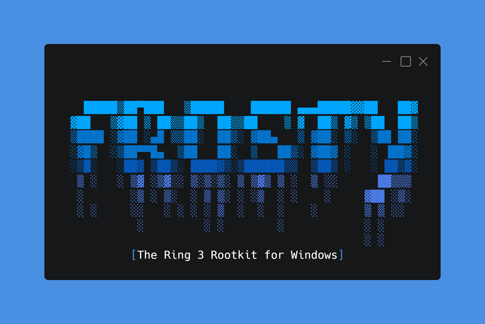

<h1 align="center">「🧊」 About Frosty</h1>

<p align="center"></p>

Frosty is a sophisticated rootkit malware developed specifically for Windows operating systems, with an emphasis on its compatibility and effectiveness with Windows 10.

A notable feature of Frosty is its use of Microsoft's Detours library. This strategic choice allows the malware to engage the Windows Native API (NTAPI), the application programming interfaces essential to the operating system's functions. Manipulating NTAPI allows Frosty to bypass conventional security measures and avoid detection by traditional methods.

**Note:** Frosty rootkit is in its early phase of development, therefore, we are in beta version. We await feedback on the rootkit so we can improve it.

## Install

### Requirements

* Operating System: Windows 10.
* Software: Microsoft Visual Studio 2022.
* Tools, Compilers: MSVC v143 Build Tools, C++ Build Insights, MSBuild.exe.

### Commands

```
git clone https://github.com/MrEmpy/Frosty.git
cd Frosty
.\builder.ps1 (x64 or x86)
ls build/
```

Execute the `build/Deployer.exe` file to automatically deploy the rootkit to the machine and execute `build/Uninstall.exe` on the machine to uninstall the Frosty rootkit.

## PoC Video

comming soon...
